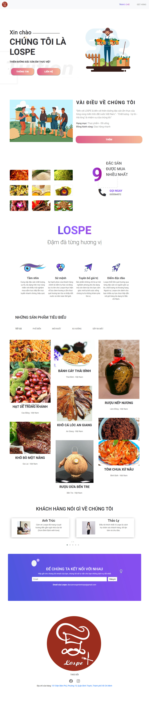
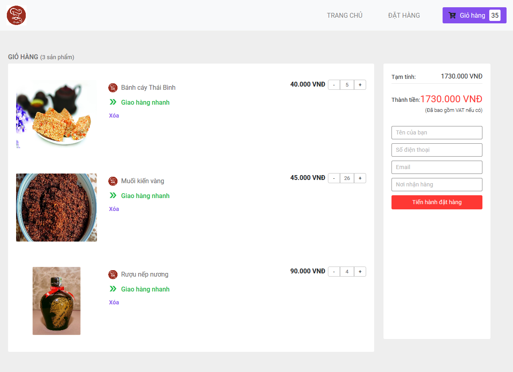
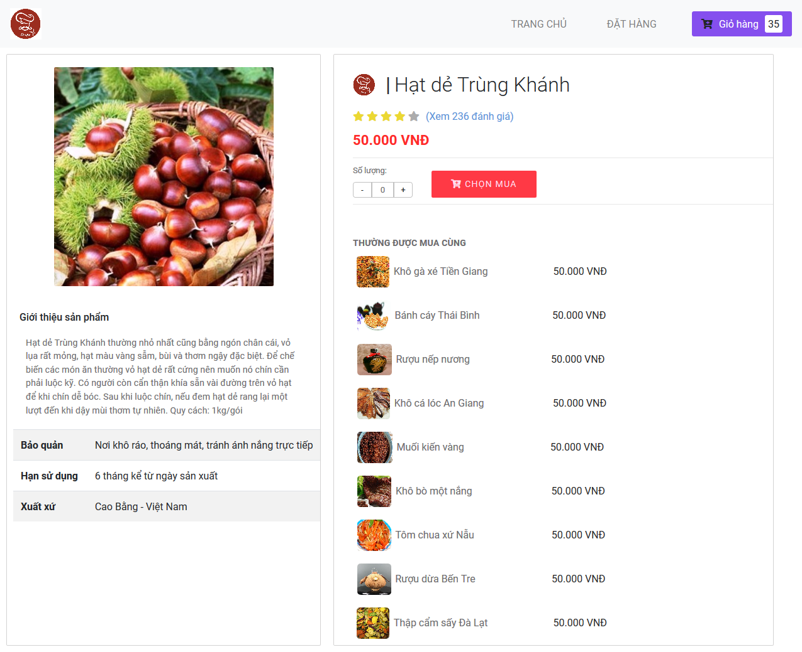
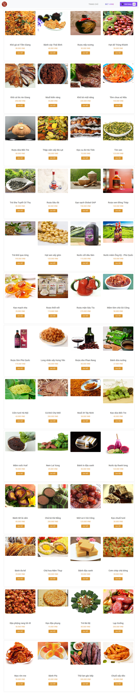

Website sale food.
Website use some skill to create:
+ HTML/CSS/JS
+ Boostrap (Make site responsive)
+ Owl-carousel - isotope ... (some more css libraries)
+ Jquery
+ JSON (Store data)
+ Local Storage
+ Use Google Sheet to store data of user order

Demo: https://dacsanvungmien.netlify.app/

Data Storage: When you order, data will send and store in google sheet 
https://docs.google.com/spreadsheets/d/170M6GPkjbImgTk-Kkt1F4YLBahtq6-w7G8Szo2NA4RU/edit#gid=1247607211

Images: 
Main Page
;

Cart:
;

Item:
;

ListProduct:
;